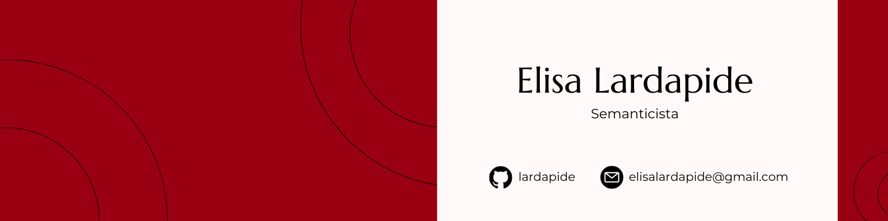

# Boas vindas 🐝

Sou bacharela em Linguística e atualmente faço mestrado em Descrição, Análise e Processamento de Línguas Naturais. Semântica é minha área principal de atuação e meu trabalho consiste no desenvolvimento de formalizações lógicas que capturem o significado de expressões em língua natural.

Uso as linguagens Agda e Scala para implementar computacionalmente, em um sistema de provas, as formalizações que desenvolvo durante meu trabalho. Meus projetos envolvem Cálculo Lambda, Gramáticas de Tipo Lógico e recursos para PLN.

Caso queira entrar em contato, é só enviar um e-mail!
elisalardapide@gmail.com

# Projetos atuais 💡
- Teste de Montague para sentenças do PB
- Papéis argumentais em Scala
- GEOki Jiten
