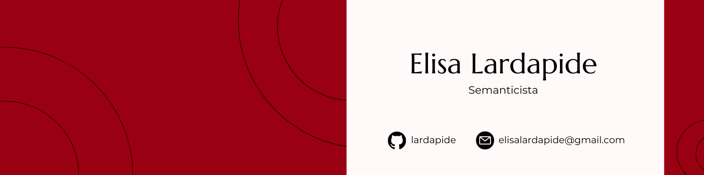

# Welcome

Hello, I'm Elisa Lardapide! 

I hold a bachelor's degree in Linguistics and am currently pursuing a master's degree in Description, Analysis, and Processing of Natural Languages. My main focus is Semantics, and my research involves developing logical formalizations to capture how meaning works in natural languages.

I use the Agda programming language to implement these formalizations in a proof assistant, which helps me verify their correctness. My projects often involve Theoretical Linguistics, Type-Logical Grammars, and building resources for NLP.

Feel free to reach out! You can email me at: elisalardapide (at) gmail (dot) com

# Projects
- Semantic System
- GEOki Jiten
